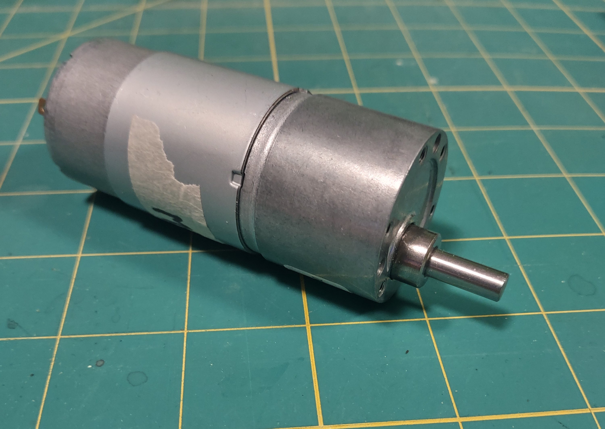
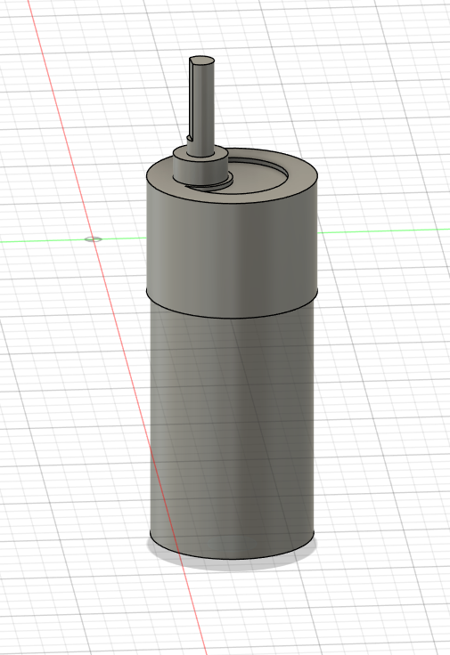
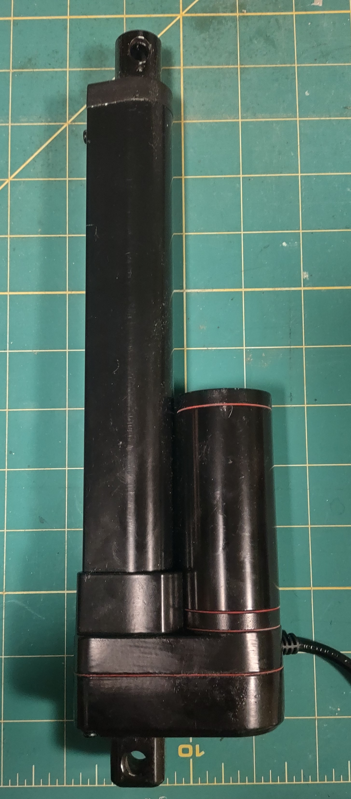
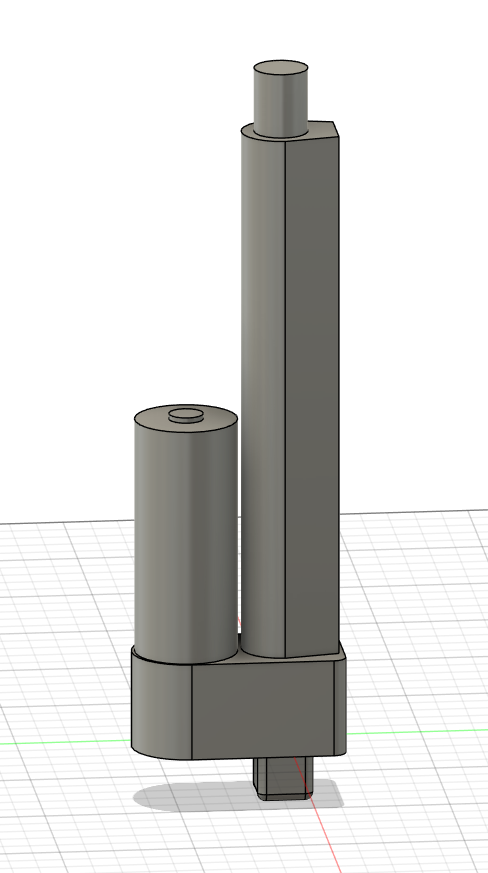
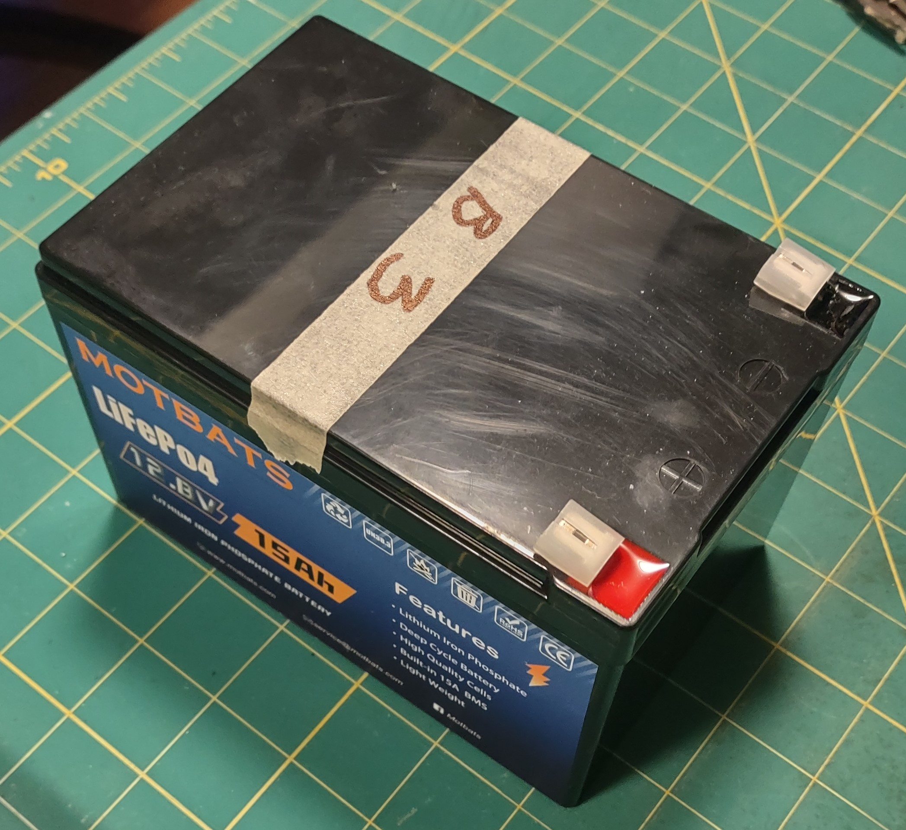
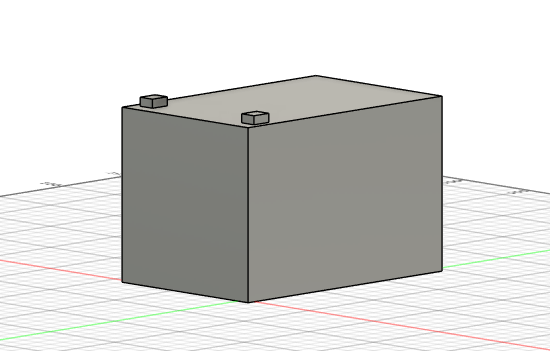
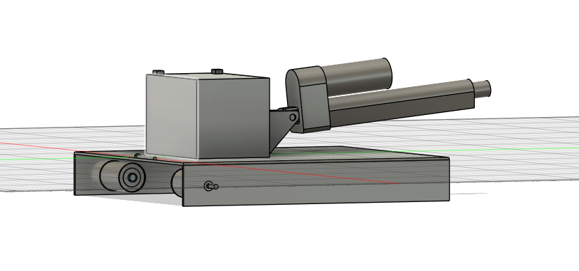

# CAD & Design

All components modeled in Fusion 360 from physical measurements taken with a digital caliper. No downloaded models or imported files - every part built from scratch to match actual hardware exactly.

---

## Drive Motor

12v DC geared motor. One per track, two per unit.

  
  

---

## Linear Actuator

Drives the scoop mechanism. Controls pickup angle and dump position.

  
  

---

## Battery

Motbats LiFePO4 12.8V 15Ah. Built-in 15A BMS. One per unit.

  
  

---

## Part Placement

Initial layout showing spatial relationships and mounting geometry before full chassis design.

---

## Final Assembly

*In progress — updated as chassis and enclosure design develops.*

---

[← Back](https://github.com/ChrisWells-Dev/autonomous-tracked-robot)
