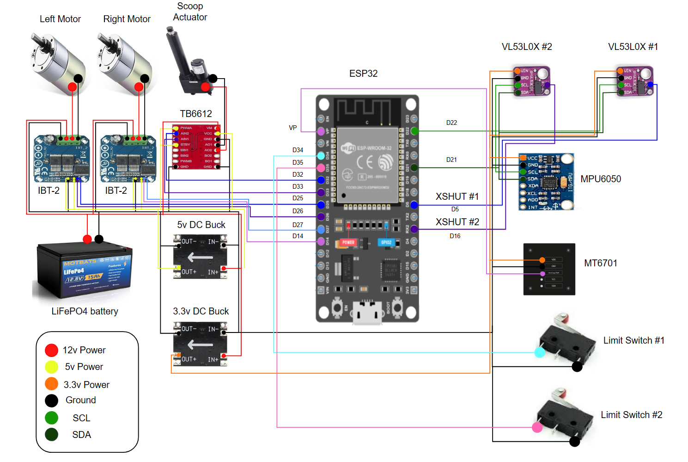

# Electronics & Wiring

## Power System

Three voltage rails, all sharing a common ground:

* **12V** from LiFePO4 battery (12.8V nominal, 15Ah) to motor drivers
* **5V** from Mini 360 DC buck converter (12V input) to IBT-2 VCC/EN and TB6612 VCC/STBY
* **3.3V** from Mini 360 DC buck converter (12V input) to all sensors

ESP32 is powered via USB only. The 3.3V sensor rail runs from a dedicated buck converter, not the ESP32's 3V3 pin.

All grounds share one common rail.

---

## Scoop Unit

### ESP32 Pin Map

| GPIO    | Function                            |
| ------- | ----------------------------------- |
| 14      | Right Motor RPWM (IBT-2 #1)         |
| 27      | Right Motor LPWM (IBT-2 #1)         |
| 25      | Left Motor RPWM (IBT-2 #2)          |
| 26      | Left Motor LPWM (IBT-2 #2)          |
| 33      | Actuator AIN1 (TB6612)              |
| 32      | Actuator AIN2 (TB6612)              |
| 16      | VL53L0X #1 XSHUT                    |
| 5       | VL53L0X #2 XSHUT                    |
| 21      | I2C SDA (shared bus)                |
| 22      | I2C SCL (shared bus)                |
| 34      | Limit switch extended (input only)  |
| 35      | Limit switch retracted (input only) |
| 36 (VP) | MT6701 encoder analog out           |
| VN      | 5V out to 5V bar                    |
| GND     | Ground bar                          |

### IBT-2 #1 (Right Motor)

| IBT-2 Pin | Connection         |
| --------- | ------------------ |
| B+        | 12V bar            |
| B-        | Ground bar         |
| M+        | Right motor lead 1 |
| M-        | Right motor lead 2 |
| VCC       | 5V bar             |
| GND       | Ground bar         |
| R\_EN     | 5V bar             |
| L\_EN     | 5V bar             |
| RPWM      | ESP32 GPIO 14      |
| LPWM      | ESP32 GPIO 27      |
| R\_IS     | Not connected      |
| L\_IS     | Not connected      |

### IBT-2 #2 (Left Motor)

| IBT-2 Pin | Connection        |
| --------- | ----------------- |
| B+        | 12V bar           |
| B-        | Ground bar        |
| M+        | Left motor lead 1 |
| M-        | Left motor lead 2 |
| VCC       | 5V bar            |
| GND       | Ground bar        |
| R\_EN     | 5V bar            |
| L\_EN     | 5V bar            |
| RPWM      | ESP32 GPIO 25     |
| LPWM      | ESP32 GPIO 26     |
| R\_IS     | Not connected     |
| L\_IS     | Not connected     |

### TB6612 (Actuator)

| TB6612 Pin | Connection                               |
| ---------- | ---------------------------------------- |
| VM         | 12V bar                                  |
| VCC        | 5V bar                                   |
| GND (x3)   | Ground bar (all three must be connected) |
| STBY       | 5V bar                                   |
| PWMA       | 5V bar                                   |
| AIN1       | ESP32 GPIO 33                            |
| AIN2       | ESP32 GPIO 32                            |
| AO1        | Actuator black wire                      |
| AO2        | Actuator red wire                        |

### VL53L0X #1 (Front Proximity)

| Sensor Pin | Connection                |
| ---------- | ------------------------- |
| VIN        | 3.3V bar (buck converter) |
| GND        | Ground bar                |
| SDA        | ESP32 GPIO 21             |
| SCL        | ESP32 GPIO 22             |
| XSHUT      | ESP32 GPIO 16             |
| GPIO1      | Not connected             |

### VL53L0X #2 (Bucket Distance)

| Sensor Pin | Connection                |
| ---------- | ------------------------- |
| VIN        | 3.3V bar (buck converter) |
| GND        | Ground bar                |
| SDA        | ESP32 GPIO 21             |
| SCL        | ESP32 GPIO 22             |
| XSHUT      | ESP32 GPIO 5              |
| GPIO1      | Not connected             |

Both VL53L0X share the I2C bus. XSHUT pins stagger initialization and assign unique I2C addresses (0x30 and 0x31) at boot.

### MPU6050 (IMU)

| Sensor Pin | Connection                        |
| ---------- | --------------------------------- |
| VCC        | 3.3V bar (buck converter)         |
| GND        | Ground bar                        |
| SDA        | ESP32 GPIO 21                     |
| SCL        | ESP32 GPIO 22                     |
| AD0        | Ground bar (sets address to 0x68) |
| INT        | Not connected                     |

### MT6701 (Magnetic Encoder)

| Sensor Pin | Connection                        |
| ---------- | --------------------------------- |
| VDD        | 3.3V bar (buck converter)         |
| GND        | Ground bar                        |
| Analog/PWM | ESP32 GPIO 36 (VP)                |
| SCL        | Not connected (using analog mode) |
| SDA        | Not connected (using analog mode) |

Outputs 0-3.3V over 360 degrees of rotation. Requires a diametrically magnetized magnet mounted on the motor shaft within 0.5-2mm of the sensor face.

### Limit Switches (Actuator End-Stops)

Two switches using COM and NO (normally open) terminals:

| Terminal | Connection            |
| -------- | --------------------- |
| COM      | Ground bar            |
| NO       | ESP32 GPIO (34 or 35) |
| NC       | Not connected         |

Requires external 10k pull-up resistors from each GPIO to the 3.3V bar.

---

## Coop Unit

### ESP32 Pin Map

| GPIO    | Function                    |
| ------- | --------------------------- |
| 14      | Right Motor RPWM (IBT-2 #1) |
| 27      | Right Motor LPWM (IBT-2 #1) |
| 25      | Left Motor RPWM (IBT-2 #2)  |
| 26      | Left Motor LPWM (IBT-2 #2)  |
| 32      | Conveyor RPWM (IBT-2 #3)    |
| 33      | Conveyor LPWM (IBT-2 #3)    |
| 16      | VL53L0X #1 XSHUT            |
| 5       | VL53L0X #2 XSHUT            |
| 21      | I2C SDA (shared bus)        |
| 22      | I2C SCL (shared bus)        |
| 36 (VP) | MT6701 encoder analog out   |
| VN      | 5V out to 5V bar            |
| GND     | Ground bar                  |

### IBT-2 #1 (Right Motor)

Same wiring pattern as Scoop IBT-2 #1.

### IBT-2 #2 (Left Motor)

Same wiring pattern as Scoop IBT-2 #2.

### IBT-2 #3 (Conveyor)

| IBT-2 Pin | Connection            |
| --------- | --------------------- |
| B+        | 12V bar               |
| B-        | Ground bar            |
| M+        | Conveyor motor lead 1 |
| M-        | Conveyor motor lead 2 |
| VCC       | 5V bar                |
| GND       | Ground bar            |
| R\_EN     | 5V bar                |
| L\_EN     | 5V bar                |
| RPWM      | ESP32 GPIO 32         |
| LPWM      | ESP32 GPIO 33         |
| R\_IS     | Not connected         |
| L\_IS     | Not connected         |

### Sensors

Coop uses the same sensor configuration as scoop:

* 2x VL53L0X (I2C, XSHUT on GPIO 16 and GPIO 5)
* 1x MPU6050 (I2C, AD0 to ground)
* 1x MT6701 encoder (analog on GPIO 36)

Wiring is identical to scoop sensor tables above.

---

## Notes

* If a motor spins the wrong direction, swap M+ and M- on that IBT-2
* IBT-2 B+ is 12V power in, M+ is motor out. Do not swap B and M terminals.
* TB6612 has 3 GND pins. All 3 must connect to ground bar.
* I2C bus stability improves with 4.7k pull-up resistors on SDA and SCL to the 3.3V rail.

---

[← Back](https://github.com/ChrisWells-Dev/autonomous-tracked-robot)
