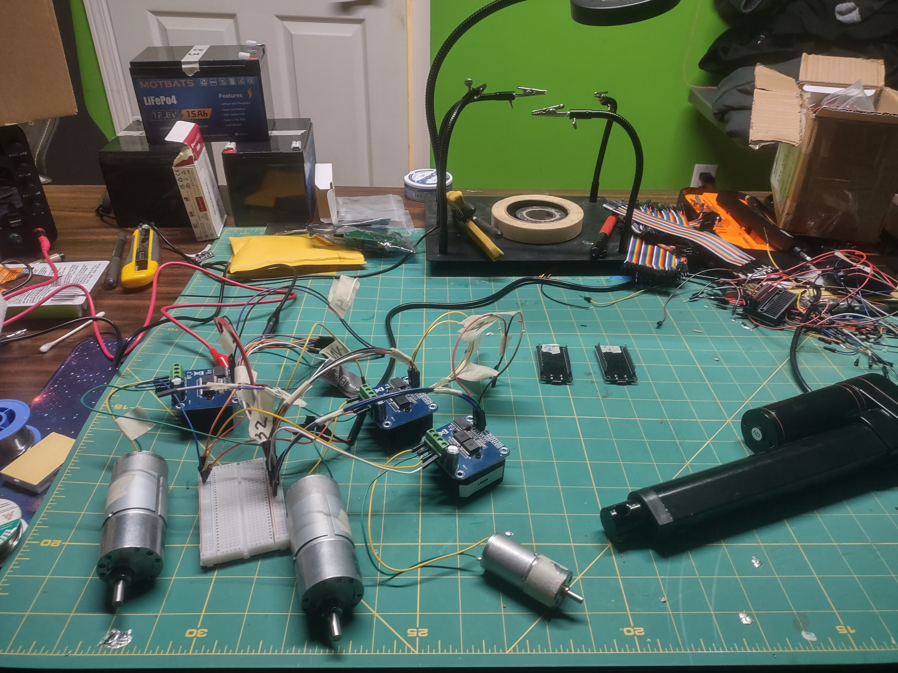
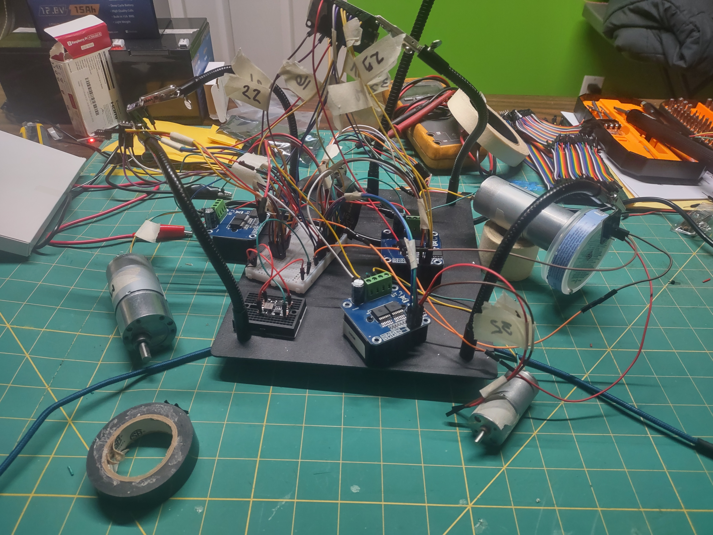

Build Log

## 2026-06-22 — Sensor Integration Complete

Full sensor suite wired and operational on the scoop unit. Both units completely wired with motor control and sensors. Rewired everything onto single labeled breadboards per unit, then integrated all sensors.

**What got done:**

* Both units fully wired: scoop (2 drive motors, actuator, sensors) and coop (2 drive motors, conveyor, sensors)
* Rewired and cleaned up all motor control to single labeled breadboards
* Added dedicated 3.3V buck converter (Mini 360) for sensor power, solving voltage drop issues that were killing I2C reliability
* Dual VL53L0X ToF sensors operational (Adafruit library, XSHUT address assignment at boot)
* MPU6050 IMU returning live accelerometer and gyroscope data
* MT6701 magnetic encoder tracking motor rotation via analog output
* Limit switches wired for actuator end-stop detection (pending pull-up resistors)
* Full JSON telemetry streaming to Pi4 at 200ms intervals over MQTT
* Created complete wiring diagrams for both units in Inkscape

**Lessons learned:**

* ESP32's 3V3 regulator cannot power sensors and WiFi simultaneously. Dedicated buck converter is mandatory.
* GPIO 17 is unreliable for XSHUT on WROOM boards. GPIO 5 works.
* Pololu VL53L0X library is flaky on ESP32. Adafruit library is stable.
* VL53L0X dual sensor init requires both XSHUT HIGH briefly before staggered shutdown and re-init sequence.

**What's next:**

* Flash coop ESP32 with matching sensor firmware
* Add 4.7k I2C pull-up resistors and 10k limit switch pull-ups when they arrive
* Build the operator control app with React and MQTT websockets
* Source aluminum for track fabrication

**Photos:**

**Sorted and reorganized breadboard for motors/drivers**

&nbsp;

**All sensors wired and tested. Full electrical mock up.**

## 2026-06-19 — Desk Demo Milestone: Full System Online

Both units are operational on the bench with bidirectional ROS2 control over MQTT.

**What got done:**

* Raspberry Pi 4 set up with Ubuntu Server 24.04 LTS and ROS2 Jazzy
* Mosquitto MQTT broker installed and configured for remote access
* ros-jazzy-mqtt-client bridging four topics (scoop cmd/status, coop cmd/status)
* Scoop ESP32 flashed and wired: two 12v drive motors via IBT-2, linear actuator via TB6612
* Coop ESP32 flashed and wired: two 12v drive motors via IBT-2, conveyor motor via IBT-2
* Full bidirectional comms confirmed: ROS2 commands reach ESP32s, ESP32 heartbeats reach ROS2
* Independent motor control on all channels (left, right, actuator/conveyor)
* PlatformIO build pipeline established in VS Code for both units

**What's next:**

* VL53L0X/L1X ToF sensor integration for proximity and dump positioning
* Limit switches for actuator end-stop detection
* MT6701 magnetic encoders on drive motors for odometry
* Teach-and-repeat path recording node on the Pi4

## 2026-06-15 — Project Started

Initial project setup. Hardware inventory completed, components measured and modeled in Fusion 360. Repository created and documentation structure established.

---

[← Back](https://github.com/ChrisWells-Dev/autonomous-tracked-robot)

