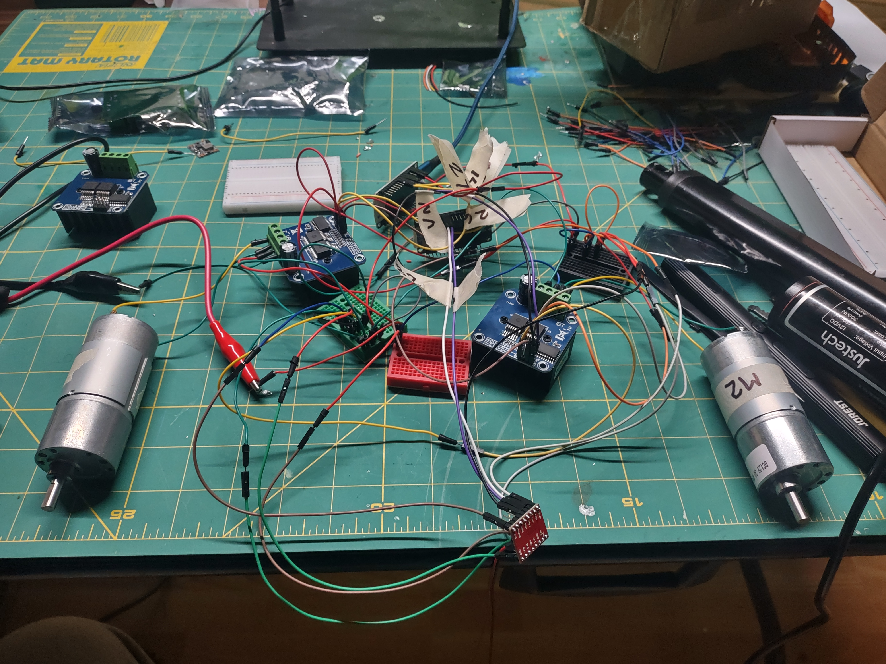

# Build Log

## 2026-06-19 — Desk Demo Milestone: Full System Online

Both units are operational on the bench with bidirectional ROS2 control over MQTT.

**What got done:**

* Raspberry Pi 4 set up with Ubuntu Server 24.04 LTS and ROS2 Jazzy
* Mosquitto MQTT broker installed and configured for remote access
* ros-jazzy-mqtt-client bridging four topics (scoop cmd/status, coop cmd/status)
* Scoop ESP32 flashed and wired: two 12v drive motors via IBT-2, linear actuator via TB6612
* Coop ESP32 flashed and wired: two 12v drive motors via IBT-2, conveyor motor via IBT-2
* Full bidirectional comms confirmed: ROS2 commands reach ESP32s, ESP32 heartbeats reach ROS2
* Independent motor control on all channels (left, right, actuator/conveyor)
* PlatformIO build pipeline established in VS Code for both units

**What's next:**

* VL53L0X/L1X ToF sensor integration for proximity and dump positioning
* Limit switches for actuator end-stop detection
* MT6701 magnetic encoders on drive motors for odometry
* Teach-and-repeat path recording node on the Pi4

 ---

## 2026-06-15 — Project Started

Initial project setup. Hardware inventory completed, components measured and modeled in Fusion 360. Repository created and documentation structure established.

---

[← Back](https://github.com/ChrisWells-Dev/autonomous-tracked-robot)
